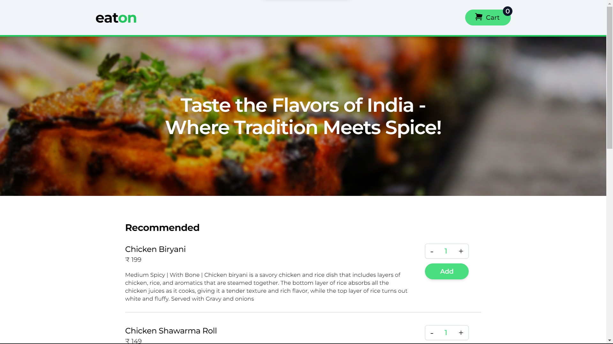
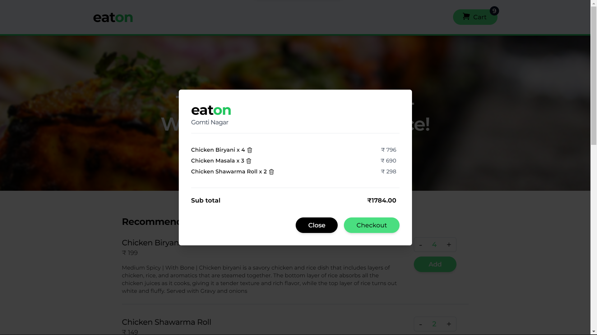
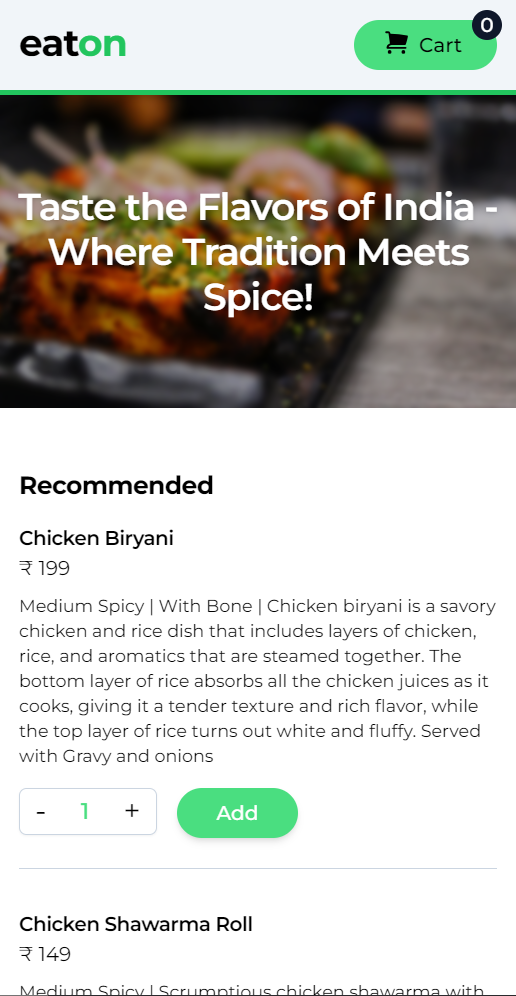
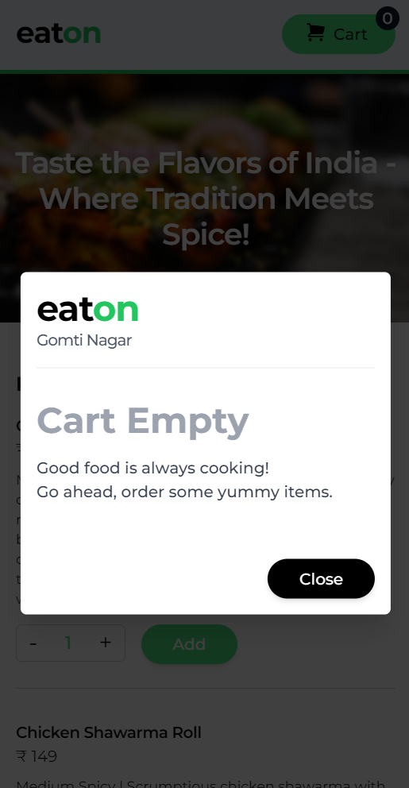
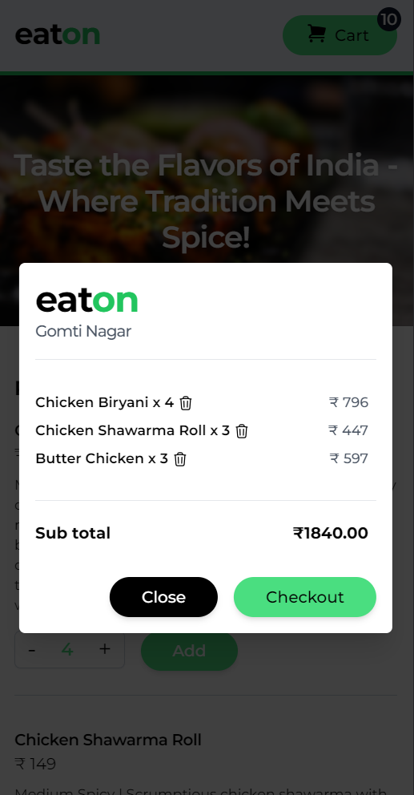

# Welcome to Eaton - a delightful food ordering app built with React! 🍔🍕🍜

Eaton brings you the best of Indian cuisine right to your fingertips. With a mix of traditional recipes and modern flavors, our app allows you to explore a diverse menu of mouthwatering dishes.

In this project, I leveraged the power of React's useState, useReducer, useRef, Portal, and forward ref hooks to create a seamless and interactive user experience. Whether you're craving savory street food or indulging in aromatic biryanis, Eaton has something to satisfy every palate.

## Screenshots

  
  

### Mobile Screenshots

  
  
  

